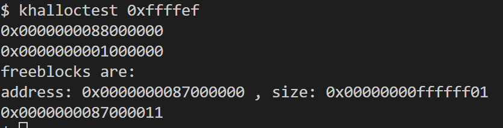
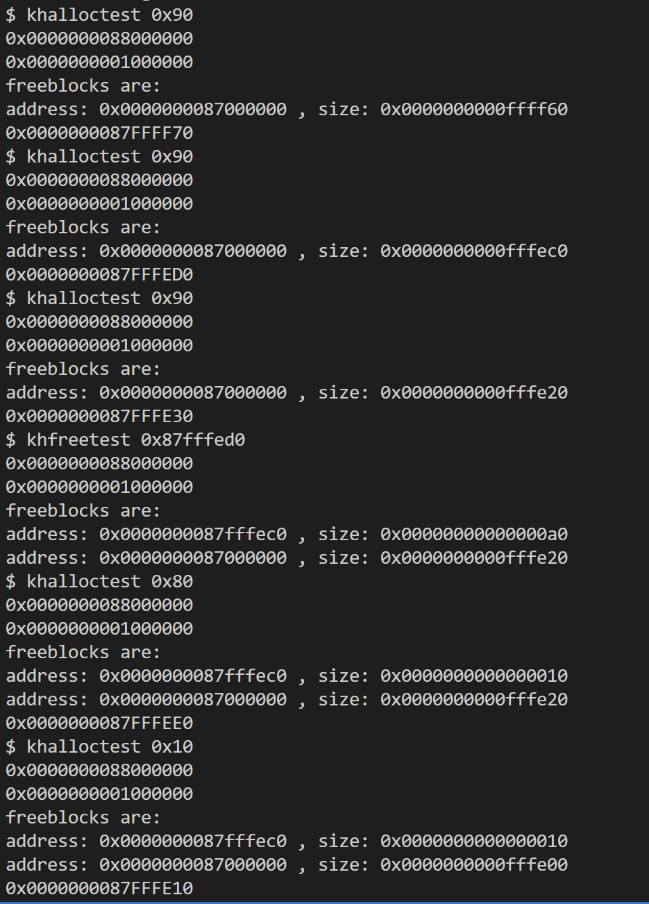
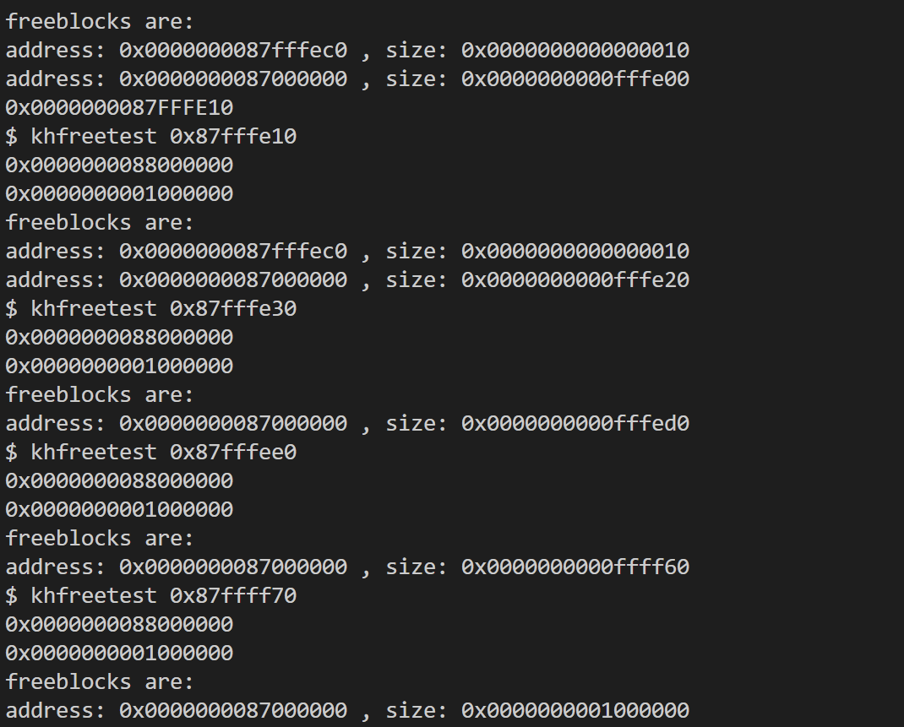

# 堆区内存分配

- ## 使用空闲链表
	### 概述
	将物理内存空间顶部的16MB空间划分为堆区内存，并相应减少分页管理区域的内存容量，但页表映射不做修改。

	我们使用空闲链表作为内存管理的数据结构，将其置于管理区域内，节点地址就是一个块的首地址。这么做是为了方便alloc和free的实现，否则需要通过遍历链表的方式查找到管理对应地址的节点。

	该方法采用循环首次适应算法。
	
	### 数据结构
	```C
	struct Header {
	struct Header* ptr;
	unsigned size;
	};
	static struct spinlock lock;

	static struct Header* base;
	static struct Header* freep;
	```
	Header为链表节点，ptr为下一个**空闲节点**
	
	我们将base作为链表头，其存储的地址是堆区内存的首地址。freep是空闲链节点指针。

	### 算法分析
	```C
	void
	khinit()
	{
		base = (struct Header*)(PHYSTOP - HEAPLEN);
		base->size = HEAPLEN;
		base->ptr = base;
		freep = base;
		initlock(&lock, "Header");
	}

	// 有效free地址应该由调用者保证
	void
	khfree(void* ap)
	{
		acquire(&lock);
		if (ap < HEAPSTART - sizeof(struct Header) || ap >= PHYSTOP) panic("khfree");

		struct Header* bp, * p;

		bp = (struct Header*)ap - 1;

		for (p = freep; !(bp > p && bp < p->ptr); p = p->ptr)
			if (p >= p->ptr && (bp > p || bp < p->ptr))
				break;
		if ((void*)bp + bp->size == p->ptr) {
			bp->size += p->ptr->size;
			bp->ptr = p->ptr->ptr;
		}
		else
			bp->ptr = p->ptr;
		if ((void*)p + p->size == bp) {
			p->size += bp->size;
			p->ptr = bp->ptr;
		}
		else
			p->ptr = bp;
		freep = p;
		release(&lock);
	}

	void*
	khalloc(uint nbytes)
	{
		acquire(&lock);
		struct Header* p, * prevp;

		if ((prevp = freep) == 0) {
			return 0;
		}
		int totalBytes = sizeof(struct Header) + nbytes;
		for (p = prevp->ptr; ; prevp = p, p = p->ptr) {
			if (p->size >= totalBytes) {
				if (p->size <= totalBytes) {
					// only remains 1 free block
					if (p->ptr == p) {
						release(&lock);
						return 0;
					}
					prevp->ptr = p->ptr;
				}
				else {
					if (p->size - totalBytes < sizeof(struct Header)) {
						release(&lock);
						return 0;
					}
					p->size -= totalBytes;
					p = (struct Header*)((void*)p + p->size);
					p->size = totalBytes;
				}
				freep = prevp;
				release(&lock);
				return (void*)(p + 1);
			}
			if (p == freep) {
				release(&lock);
				return 0;
			}
		}
	}
	```
	1. **kinit** 初始化链表，将 **base** 设置为头节点，并初始化链表的自旋锁，以保证内存管理的原子性。

	2. 
		**khalloc** 以字节为单位分配内存，首先检测 		**freep** 是否为 **null** ，如果为 **null** 则代表没有空闲空间，此时分配失败，返回 **null** 。因为采用的是循环首次适应，所以 **freep** 在每次分配完成后，都需要置为上一个节点，这与一般的的循环首次适应有微小的差别。

		**totalBytes** 计算本次分配需要花费多少字节的空间。

		循环体的工作是查找能够分配的空闲块，并分配，如果找不到空闲块，也就是 **p** 循环一圈回到了 **freep**，则分配失败，返回 **null**。

		分配的时候采用高地址优先的策略，当块大小正好等于待分配大小时，将 **freep** 的下一个节点置为 **p** 的下一个节点。这里需要考虑一种特殊情况：当申请的空间正好等于剩余的全部空间时，空闲链在分配后为空，此时应该禁止分配。

		当块大小小于待分配大小时，将 **p** 的大小缩减相应数值，并且为分配的块构建一个节点，指向下一个空闲块。此时也有一种特殊情况，当 **p** 的大小缩减之后不够分配节点时，也应该禁止分配，否则会导致越界访问。分配结束后，空闲链节点只有一个字节的空间，此时还有15字节的空间位于下一个已分配的链节点，因此打印 **size** 的时候，结果是第8、9、10、11字节的内容。

	3. **khfree** 接收一个地址，并释放对应的块。

		首先获取块的头节点 **bp**，将bp置于前后两个空闲块节点 **p** 和 **p->ptr** 之间，然后根据三个块之间的关系，进行合并空闲块。

	### 效率评估
	1. 查找效率

		不论采取何种适应算法，查找的时间复杂度都为O(n)，并且循环首次适应可能在时间上要优于最佳适应和最坏适应。由于首次适应和循环首次适应是对块地址的顺序遍历，与块大小无关，因此采用链表作为管理结构是比较好的选择，找到对应块的时间要优于二叉树。

	2. 存储效率

		由于该方法将管理结构放在了待管理空间内，每产生一个块，都会造成16Byte空间的浪费。并且当前的算法会导致一个违背直觉的问题，当申请空间的大小不足以剩下一个完整的节点空间时，会拒绝分配，但当申请空间完全覆盖了原有的完整节点空间时，反而能够分配。

	### 测试结果
	- 
	- 

- ## 使用红黑树

	### 概述

	采用两个红黑树管理堆区内存，管理结构存储在页式管理的内存区。每个节点管理一块堆区内存。两个红黑树分别使用地址和块大小作为索引，前者能够加快 **free** 的过程，并且便于进行(循环)首次适应算法，后者能够加快最佳匹配和最差匹配算法。

	### 数据结构

	```C
	struct rbnode {
		unsigned addr;
		unsigned size;
		Color color;
		int is_free;
		int parent;
		int left;
		int right;
	};

	struct rbnode_view {
		unsigned addr;
		unsigned size;
		Color color;
		int is_free;
		struct rbnode* ptr;
	};

	struct rbtree {
		struct rbnode* root;
		struct rbnode* nil;
		int (*comp)(void*, void*);
	};
	```
	**rbnode** 具有 **addr**, **size**, **is_free** 三个与内存相关的字段，分别代表堆首地址到块首地址的偏移量，块大小，块是否空闲。节点的 **parent**, **left**, **right** 分别表示当前节点到父节点、左子节点和右子节点的偏移量。为了节省空间，这里的指针全部代表相对 **kernel** 的 **data** 内存区起始地址的偏移量

	**rbtree** 具有 **root**, **nil** 和 **comp**，分别代表根节点、null节点和比较函数。比较函数接收两个对象，并返回比较结果，**前者&lt;后者** 则返回负数，**前者==后者** 则返回0，**前者&gt;后者**则返回正数。

	**rbnode_view** 是一个红黑树节点的一个视图，是对应节点信息的一个拷贝。在使用红黑树返回的节点时，应该将其转化为**rbnode_view**，防止因树中节点值发生改变而导致的错误。

	### 数据结构存储管理

	我们将数据结构存储在页式管理内存区域。用链表将所有存储数据结构的页串起来，并采用空闲链的方式管理红黑树节点，算法与 **kalloc** 和 **kfree** 相同，但需要为每一个页都设置一条链，不同链之间没有关联。首先分配一个页，页首字段存储下一个页首地址、页内空闲链头指针、该页已分配的节点数，剩余字段初始化为空闲节点。此外，需要有一个页链的头指针。在分配节点(**blkalloc**)的时候，从页链头开始遍历链表，获取第一个有空闲块的页，将该页中空闲链的头节点分配给调用者，并调整头节点，将已分配节点数加一。如果遍历结束仍未找到有空闲块的页，则需要 **kalloc** 一个新的页，并初始化。在释放节点(**blkfree**)的时候，先找到释放节点所在的页，然后将该节点加入页内的空闲链表，将已分配节点数减一。如果 **blkfree** 不是在页初始化阶段调用的，那么当释放完成之后，如果页内已分配节点数为0，则需要释放该页。此时按照单链表的删除方法将该页移出链表，并调用 **kfree** 即可。

	```C
	struct blockNode {
		struct blockNode* next;
	};

	static struct blockNode pageChain;
	static struct spinlock pagelock;
	struct blockNode* page_head(void* pa)
	{
		return (struct blockNode*)pa;
	}

	struct blockNode* page_freelist(void* pa)
	{
		return (struct blockNode*)pa + 1;
	}

	uint* page_allocatedBlocks(void* pa)
	{
		return (uint*)(pa + 16);
	}
	// caller should ensure that ba is valid
	void
	blkfree(void* ba)
	{
		struct blockNode* nd = (struct blockNode*)ba;
		void* pa = (void*)PGROUNDDOWN((uint64)ba);
		if (!is_initializing)
			acquire(&pagelock);

		nd->next = page_freelist(pa)->next;
		page_freelist(pa)->next = nd;

		if (!is_initializing) {
			(*page_allocatedBlocks(pa))--;
			// 如果为空，且当前不是初始化阶段，则释放该页
			if (!*page_allocatedBlocks(pa)) {
				struct blockNode* next = page_head(pa)->next;
				struct blockNode* p;
				for (p = &pageChain; p->next != pa; p = p->next);
				p->next = next;
				kfree(pa);
			}
			release(&pagelock);
		}
	}

	int
	initpage(void* page_start)
	{
		if (page_start == 0) return 0;
		acquire(&pagelock);
		is_initializing = 1;
		// 首节点存放下一个页的指针,当前页内block的freelist和已分配块的数量
		page_head(page_start)->next = pageChain.next;
		pageChain.next = page_head(page_start);
		page_freelist(page_start)->next = 0l;
		*page_allocatedBlocks(page_start) = 0;
		char* p;
		for (p = page_start + PGHEAD_SIZE; p + sizeof(Rbnode) - (char*)page_start <= PGSIZE; p += sizeof(Rbnode))
			blkfree(p);
		is_initializing = 0;
		release(&pagelock);
		return 1;
	}

	void*
	blkalloc()
	{
		struct blockNode* node;
		acquire(&pagelock);
		// 如果page的freelist的next字段为0，则意味着该页已没有空余块，需要继续查找
		void* pa;
		for (pa = pageChain.next; pa != 0 && page_freelist(pa)->next == 0; pa = page_head(pa)->next);

		// 如果pa为0，则说明找不到可分配的块，此时需要申请新的页
		if (pa == 0) {
			// 如果initpage失败，说明当前内存已不够分配更多的页，分配失败
			release(&pagelock);
			if (!initpage(kalloc())) return 0;
			acquire(&pagelock);
			pa = pageChain.next;
		}

		// 分配页内的块
		node = page_freelist(pa)->next;
		page_freelist(pa)->next = node->next;
		(*page_allocatedBlocks(pa))++;
		release(&pagelock);
		return node;
	}

	void
	blkinit()
	{
		initlock(&pagelock, "pageChain");
		initlock(&treelock, "treelock");
		if (!initpage(kalloc())) {
			panic("blkinit");
		}
	}

	void
	khinit()
	{
		blkinit();
		init_rbtree(&tree_addr, blkalloc(), blkalloc(), cmpbyaddr);
		init_rbtree(&tree_size, blkalloc(), blkalloc(), cmpbysize);
	}
	```

	### 算法分析

	数据结构采用红黑树，保证具有较高的插入和删除效率。初始化两棵红黑树，一个以块首地址为索引，一个以块大小为索引。**alloc** 实现了四种算法：首次适应、循环首次适应、最佳适应、最坏适应。其中，首次适应和循环首次适应需要搜索以地址为索引的红黑树(以下记作 **addr_tree** )，最佳适应和最坏适应需要搜索以块大小为索引的红黑树(以下记作 **size_tree** )。free算法搜索 **addr_tree**，找到对应的节点之后进行处理。在所有的处理过程中需要保持两棵树的一致性。

	1. **alloc** 算法

		由于四种算法在实现上大同小异，这里只展示最佳适应算法。

		```C
		void*
		khalloc(uint nbytes)
		{
			if (nbytes == 0) return 0;
			acquire(&treelock);
			Rbnode* min = getmin(&tree_size, tree_size.root);
			for (Rbnode* pnd = min;; pnd = step(&tree_size, pnd)) {
				// 如果当前节点为nil，说明没有可分配的块，分配失败
				if (pnd == tree_size.nil) {
					release(&treelock);
					return 0;
				}
				RbnodeView nd = getView(pnd);
				if (!nd.is_free) continue;
				// 如果申请的空间小于当前块大小，则减小块大小，并更新tree_size的结构
				if (nd.size > nbytes) {
					blkfree(remove_node(&tree_size, pnd));
					nd.size -= nbytes;
					if (nd.size > 0) {}
					void* addr = blkalloc();
					if (!addr) {
						release(&treelock);
						return 0;
					}
					insert_node(&tree_size, init_node(&tree_size, addr, OFFTOADDR(nd.addr), nd.size, 1, RED));
					find_node(&tree_addr, tree_addr.root, nd)->size -= nbytes;
					// 插入新增的已分配块节点
					void* node_addr_addr = blkalloc();
					if (!node_addr_addr) {
						release(&treelock);
						return 0;
					}
					void* node_addr_size = blkalloc();
					if (!node_addr_size) {
						blkfree(node_addr_addr);
						release(&treelock);
						return 0;
					}
					void* ret = OFFTOADDR(nd.addr) + nd.size;
					Rbnode* newNode_addr = init_node(&tree_addr, node_addr_addr, ret, nbytes, 0, RED);
					Rbnode* newNode_size = init_node(&tree_size, node_addr_size, ret, nbytes, 0, RED);
					insert_node(&tree_addr, newNode_addr);
					insert_node(&tree_size, newNode_size);
					release(&treelock);
					return ret;
				}
				// 如果申请的空间正好等于当前块大小，则将对应节点is_free设置为0
				if (nd.size == nbytes) {
					nd.is_free = 0;
					find_node(&tree_addr, tree_addr.root, nd)->is_free = 0;
					find_node(&tree_size, tree_size.root, nd)->is_free = 0;
					void* ret = OFFTOADDR(nd.addr);
					release(&treelock);
					return ret;
				}
			}
			// 理论上不执行
			return 0;
		}
		```

		首先检查申请大小是否为0，这是因为如果为0，则会产生一个 **size** 为0的节点，而返回的地址也无法使用。

		然后获取 **size_tree** 的最小节点，也即管理最小块的节点。**nd** 将在每轮循环中步进，直到找到合适的节点或到达 **nil** 节点。在循环内部，首先检查节点是否为 **nil**，并跳过已分配内存的节点。接下来有两种情况：申请空间小于块大小和申请空间等于块大小(如果申请空间大于块大小，则进入下一轮循环)。
		
		对于小于的情况，首先将 **size_tree** 的对应节点的size减少申请字节数，由于 **size_tree** 以块大小为索引，不能直接改变节点的字段，否则会破坏红黑树的有序性。此时需要先将该节点 **remove**，更改之后再 **insert**。同时，直接将 **addr_tree** 的对应节点的 **size** 减小相同值。原有的节点更新之后，还需要插入新增的节点，即管理分配给调用者的那一块的节点。此时需要进行 **blkalloc** 为新节点分配地址，完成之后，**init_node** 初始化新节点，并插入。

		对于等于的情况，直接将对应节点的 **is_free** 字段置为0.

		我们取到节点后，要立即将其转换为 **rbnode_view** ，这样在 **insert** 和 **remove** 的时候，如果改变了节点的值(在交换节点的过程中会发生，这意味着是否为同一个节点是由**addr**字段决定的，而不是节点地址)，不会影响到 **rbnode_view**，使用 **find_node** 即可获取 **rbnode_view** 对应的节点。

		3. free算法
			四种分配算法的 **free** 算法都一样，通过查找管理要 **free** 的地址的节点，进行处理。这也是选择红黑树的原因之一，如果选择链表，则需要遍历链表才能查找对应的节点。
			```C
			void
			khfree(void* pa)
			{
				if (pa == 0) return;
				if ((uint64)pa < HEAPSTART || (uint64)pa >= PHYSTOP) panic("khfree");
				acquire(&treelock);
				RbnodeView rmNode;
				rmNode.addr = (uint64)pa - HEAPSTART;
				Rbnode* prmNode = find_node(&tree_addr, tree_addr.root, rmNode);
				rmNode = getView(prmNode);
				// 保证free的地址一定是分配出去的地址
				if (prmNode == tree_addr.nil || rmNode.is_free) {
					release(&treelock);
					panic("khfree");
				}
				RbnodeView prev = getView(step_back(&tree_addr, prmNode));
				RbnodeView next = getView(step(&tree_addr, prmNode));
				int integrate_next = 0;
				int integrate_prev = 0;
				RbnodeView rmnd_size = getView(find_node(&tree_size, tree_size.root, rmNode));
				RbnodeView pvnd_size = getView(find_node(&tree_size, tree_size.root, prev));
				((Rbnode*)rmNode.ptr)->is_free = 1;
				((Rbnode*)rmnd_size.ptr)->is_free = 1;
				// 后节点能合并
				if (next.ptr != tree_addr.nil && rmNode.addr + rmNode.size == next.addr && next.is_free) {
					blkfree(remove_node(&tree_size, find_node(&tree_size, tree_size.root, rmnd_size)));
					blkfree(remove_node(&tree_size, find_node(&tree_size, tree_size.root, next)));
					rmnd_size.size += next.size;

					blkfree(remove_node(&tree_addr, find_node(&tree_addr, tree_addr.root, next)));
					blkfree(remove_node(&tree_addr, find_node(&tree_addr, tree_addr.root, rmNode)));
					rmNode.size += next.size;

					integrate_next = 1;
				}
				// 前节点能合并
				if (prev.ptr != tree_addr.nil && prev.addr + prev.size == rmNode.addr && prev.is_free) {
					// 防止重复删除
					if (!integrate_next) {
						blkfree(remove_node(&tree_size, find_node(&tree_size, tree_size.root, rmnd_size)));
						blkfree(remove_node(&tree_addr, find_node(&tree_addr, tree_addr.root, rmNode)));
					}

					blkfree(remove_node(&tree_size, find_node(&tree_size, tree_size.root, pvnd_size)));
					pvnd_size.size += rmnd_size.size;

					blkfree(remove_node(&tree_addr, find_node(&tree_addr, tree_addr.root, prev)));
					prev.size += rmNode.size;


					void* addr1 = blkalloc();
					void* addr2 = blkalloc();
					if (!addr1) {
						release(&treelock);
						return;
					}
					if (!addr2) {
						blkfree(addr1);
						release(&treelock);
						return;
					}
					insert_node(&tree_size, init_node(&tree_size, addr1, OFFTOADDR(pvnd_size.addr), pvnd_size.size, 1, RED));
					insert_node(&tree_addr, init_node(&tree_addr, addr2, OFFTOADDR(prev.addr), prev.size, 1, RED));
					integrate_prev = 1;
				}
				if (integrate_next && !integrate_prev) {
					void* addr1 = blkalloc();
					void* addr2 = blkalloc();
					if (!addr1) {
						release(&treelock);
						return;
					}
					if (!addr2) {
						blkfree(addr1);
						release(&treelock);
						return;
					}
					insert_node(&tree_size, init_node(&tree_size, addr1, OFFTOADDR(rmnd_size.addr), rmnd_size.size, 1, RED));
					insert_node(&tree_addr, init_node(&tree_addr, addr2, OFFTOADDR(rmNode.addr), rmNode.size, 1, RED));
				}
				release(&treelock);
			}
			```
			首先要检查 **free** 的地址是否是已分配出去的地址(**null**除外)，以确保安全。

			接下来将两棵树的对应节点的 **is_free** 字段都置为1，表示已释放。然后考虑能否合并前后节点，这里对于 **addr_tree** 和 **size_tree** 的处理一样，如果后节点能合并，则直接remove后节点和当前节点，并将当前节点的 **size** 增加对应值，插入树中，如果前节点能合并，则做相同处理。

			这里对于 **addr_tree** 的节点也做删除处理，而不是直接改变 **size** 是因为如果后节点能合并，那么还需要删除当前节点，为了保证统一性并减少意料之外的错误，**addr_tree** 的节点也要先删后加。

	### 效率评估
	采用红黑树作为管理内存的数据结构，对于内存区很大且频繁alloc和free的情况具有更高的效率，前提是使用最佳适应或最坏适应，此时算法复杂度为 **O(log n)**。但如果使用首次适应或循环首次适应，则算法复杂度为 **O(n)**，由于具有更复杂的算法，理论上会慢于链表。

	在空间上，该算法分配了更大的内存用来存储管理结构，但好处是不需要占据管理区域的内存，而且能够一定程度上防止非法的越界访问破坏管理结构的情况。